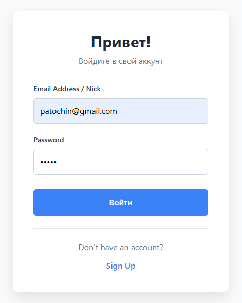
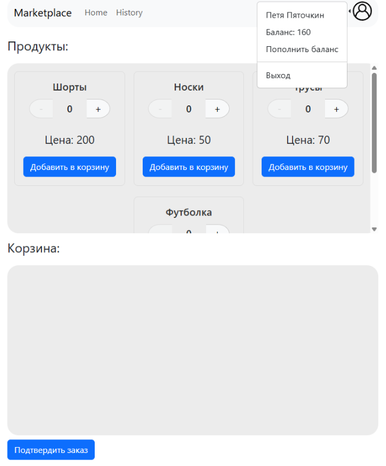
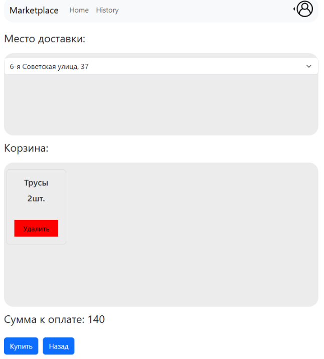
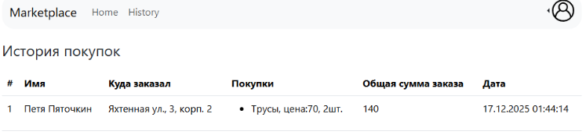

GoMarketPlace
Проект маркетплейса с микросервисной архитектурой.

Стэк: Go, GIN, PostgreSQL БД, Apache Kafka, Redis, REST, JWT Auth. Проект полностью упакован в docker-compose.
- процесс покупки товара осуществлен с помощью паттерна SAGA (оркестрация)

Проект GoMarketPlace является веб-приложением магазина. Данный проект позволяет просматривать каталог товара, создавать заказ, оформлять заказ в выбранное пользователем место (пункт выдачи) и осуществлять покупку.

Веб приложение содержит авторизацию, у пользователя есть имя и баланс кошелька.

Ниже приведены экраны приложения:

Экран авторизации. 

Экран каталога товаров и корзины. 

Экран оформления заказа. 
Экран осуществленных покупок. 

This repo contains docker-compose file, so if you have installed docker in your computer:
1) run "docker-compose up -d"
2) go to "http://localhost:3000/"
3) login with user "patochin@gmail.com" and password "12345"
4) enjoy it !!!